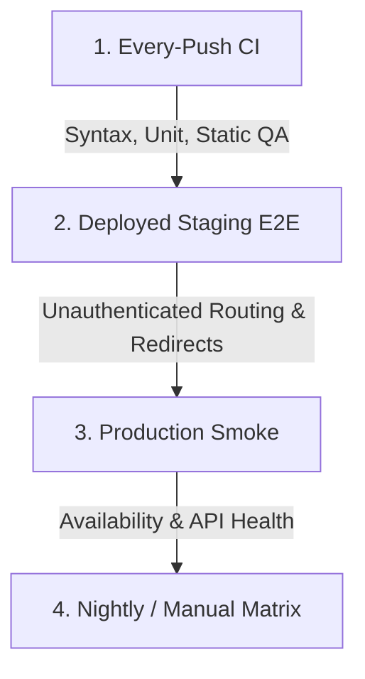

# CI Regression Expansion + Staging E2E Matrix

**Engineering Control Document — Session 140Z-G3-D1**
**Status:** **PARTIAL PASS** — Playwright staging route/auth-guard/API-health smoke framework added. Latest deployed staging run passed 12 unauthenticated checks with 2 authenticated checks skipped because credentials were not provided. This is not complete app feature E2E and does not verify attribution, install, dashboard data, report builder, billing, conversion ingest, integrations, settings mutations, or production auth. Paid beta remains NOT READY.

> [!WARNING]
> **Staging E2E Testing Caveats:**
> - **Unauthenticated Routes E2E**: Staging E2E runner verifies unauthenticated route and auth-guard redirects.
> - **API Health Check**: Successfully passed against `https://sourcetrack-api-staging.up.railway.app/api/health`.
> - **Authenticated Routes**: Conditional checks were skipped cleanly due to missing environment credentials.
> - **Deeper Feature E2E**: Mutating actions (Stripe, Google OAuth, Shopify, resets) are explicitly deferred to nightly/manual verification.

This document defines the layered regression testing plan to stop manual back-and-forth QA, establish a scalable regression matrix, and verify the frontend, backend, and API on deployed domains.

---

## 1. Layered Testing Architecture

The regression system is organized into four distinct operational layers, moving from fast, safe compile-time checks to authenticated real-browser staging execution:



### Layer 1: Every-Push CI
* **Objective:** Fast, non-flaky checks running on every git push or pull request to `main`.
* **Scope:** Syntax check, static launch audits, git whitespace checks, secret checks, and backend unit/integration tests (identity, billing, tracker, attribution math).
* **Environment:** GitHub Actions runner (local mock context, no live DB connection, no browser tests).

### Layer 2: Deployed Staging E2E
* **Objective:** Automated, non-mutating browser tests verifying SPA routing and asset load safety.
* **Scope:** DOM structure, public routes, unauthenticated redirects of protected pages, API health, console JS exception capture, and failed JS/CSS asset load checks. Optional authenticated E2E verification if credentials are provided in the environment.
* **Environment:** Local or CI trigger targeting the deployed staging domains:
  - Frontend: `https://sourcetrack-dashboard-staging.up.railway.app`
  - API: `https://sourcetrack-api-staging.up.railway.app`

### Layer 3: Production Smoke Checks
* **Objective:** Non-mutating availability checks verifying that the canonical domain serves the SPA cleanly and that the backend API is online.
* **Scope:** Availability of `/login`, `/signup`, `/reset-password`, and `/dashboard`, asset reference checks, and `/api/health` online checks.
* **Environment:** Executed against canonical custom domains:
  - Frontend: `https://app.sourcetrack.ai`
  - API: `https://api.srctk.com`

### Layer 4: Nightly / Manual Matrix (Deeper App Verification)
* **Objective:** Deeper authenticated verification of features and user flows.
* **Scope:** Custom conversion verification, manual checkout/portal checks, third-party webhook verification, and manual UI inspections.
* **Environment:** Deployed staging or production domains using dedicated test accounts.

---

## 2. QA Coverage Matrix

The table below catalogs every critical route, backend primitive, and system boundary, detailing its current coverage state and how it maps to our testing layers.

| Target Primitive / Route | Status | Covered Now | Staging E2E | Production Smoke | Nightly/Manual |
| :--- | :--- | :--- | :--- | :--- | :--- |
| **`/login` rendering & forms** | Covered | Yes ([auth.spec.ts](../../tests/e2e/auth.spec.ts)) | ✅ Checked | ✅ Route Smoke | — |
| **`/signup` rendering & forms** | Covered | Yes ([auth.spec.ts](../../tests/e2e/auth.spec.ts)) | ✅ Checked | ✅ Route Smoke | — |
| **`/forgot-password` rendering** | Covered | Yes ([auth.spec.ts](../../tests/e2e/auth.spec.ts)) | ✅ Checked | — | — |
| **`/reset-password` (no session)** | Covered | Yes ([auth.spec.ts](../../tests/e2e/auth.spec.ts)) | ✅ Checked | ✅ Route Smoke | — |
| **`/auth/callback` (no token)** | Covered | Yes ([auth.spec.ts](../../tests/e2e/auth.spec.ts)) | ✅ Checked | — | — |
| **Unauth `/dashboard` redirect** | Covered | Yes ([routes.spec.ts](../../tests/e2e/routes.spec.ts)) | ✅ Checked | ✅ Redirect | — |
| **Unauth `/onboarding` redirect** | Covered | Yes ([routes.spec.ts](../../tests/e2e/routes.spec.ts)) | ✅ Checked | — | — |
| **Unauth `/app/integrations` redirect** | Covered | Yes ([routes.spec.ts](../../tests/e2e/routes.spec.ts)) | ✅ Checked | — | — |
| **Unauth `/settings` redirect** | Covered | Yes ([routes.spec.ts](../../tests/e2e/routes.spec.ts)) | ✅ Checked | — | — |
| **Unauth `/billing` redirect** | Covered | Yes ([routes.spec.ts](../../tests/e2e/routes.spec.ts)) | ✅ Checked | — | — |
| **Unauth `/setup` redirect** | Covered | Yes ([routes.spec.ts](../../tests/e2e/routes.spec.ts)) | ✅ Checked | — | — |
| **API Health check (`/api/health`)** | Covered | Yes ([routes.spec.ts](../../tests/e2e/routes.spec.ts)) | ✅ Checked | ✅ API Health | — |
| **Console JS Exception Capture** | Covered | Yes (All specs hooks) | ✅ Captured | — | — |
| **Failed JS/CSS Asset Load** | Covered | Yes (All specs hooks) | ✅ Captured | — | — |
| **Secret Scanning Safety** | Covered | Yes (`npm run qa:secrets`) | — | — | — |
| **Release Readiness Gate** | Covered | Yes (`node scripts/qa-release-readiness.mjs`) | — | — | — |
| **Attribution Engine Calculations** | Covered | Yes (`npm run qa:attribution:unit`) | — | — | — |
| **Deduplication Verification** | Covered | Yes (`scripts/qa-runtime-smoke.mjs`) | — | — | — |
| **Staging/Prod PostHog Isolation** | Covered | Yes (manual check verify event logs) | — | — | ✅ Nightly |
| **Real Google OAuth** | **Not Automated** | No (Blocked by Google OAuth UI redirects) | — | — | 🛠️ Manual |
| **Real Stripe Checkout & Portal** | **Not Automated** | No (Blocked by live checkout requirements) | — | — | 🛠️ Manual |
| **Shopify Webhooks & Recipe** | **Not Automated** | No (Requires live Shopify store events) | — | — | 🛠️ Manual |
| **Prod Password Reset Mutation** | **Not Automated** | No (Safety boundary — no production mutations) | — | — | 🛠️ Manual |
| **Prod Customer Data Mutations** | **Not Automated** | No (Safety boundary — no production mutations) | — | — | 🛠️ Manual |

---

## 3. Test Runbooks and Execution Commands

### A. Local and CI Checks (Every Push)
These are fast, run locally or in GitHub Actions, and do not hit external networks:
```bash
# Syntax and static checks
npm run qa:static

# Run unit test suites
npm run qa:identity:unit
npm run qa:tracker:unit
npm run qa:attribution:unit
```

### B. Deployed Staging E2E Checks
These verify the actual staging app deployment. By default, they skip the authenticated tests.

#### Explicit browser installation (Chromium only):
```bash
npx playwright install chromium
```

#### Run tests (Unauthenticated):
```bash
# Using the default staging domains
npm run qa:staging-e2e

# Specifying custom targets (e.g. localhost testing)
PLAYWRIGHT_BASE_URL=http://localhost:5173 SOURCETRACK_API_URL=http://localhost:3000 npm run qa:staging-e2e
```

#### Run tests (Authenticated):
To run the full suite including the authenticated dashboard and setup route verification:
```bash
SOURCETRACK_TEST_USER_EMAIL=user@example.com \
SOURCETRACK_TEST_USER_PASSWORD=your_secure_password \
npm run qa:staging-e2e
```

### C. Production Smoke Checks
Run the lightweight, non-mutating smoke script targeting the canonical domain:
```bash
# Target production app & API
AUTH_SMOKE_BASE_URL=https://app.sourcetrack.ai \
SOURCETRACK_API_URL=https://api.srctk.com \
node scripts/qa-production-auth-smoke.mjs
```
