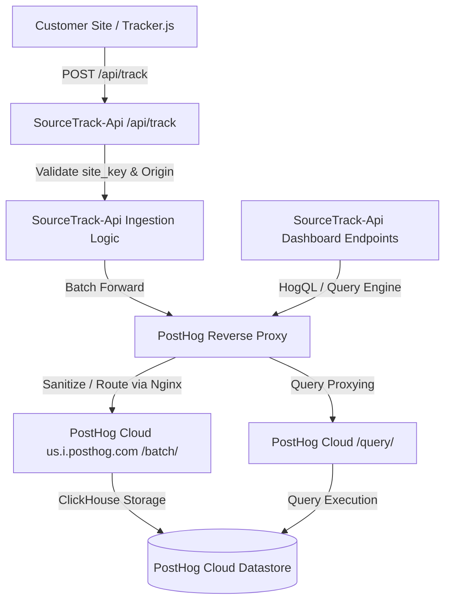

# Session 140C — PostHog Proxy & Event Routing Verification

## Verdict
PASS

## Scope
Verification of end-to-end event routing, PostHog proxy configuration, environment separation, and validation of resolved environment key configuration on Staging.

## 1. PostHog References Audit
We performed a codebase-wide audit of all references to PostHog, tracking hosts, and associated configuration parameters.

### Matches Found
* **`POSTHOG_HOST` / `PH_HOST` / `posthog` references:**
  - `api/lib/posthog.js`: Initializes the PostHog client using `POSTHOG_API_KEY` and `POSTHOG_HOST` (routing through the proxy).
  - `api/routes/track.js` & `api/routes/conversion.js`: Event ingestion routes forwarding request data to the PostHog instance.
  - `api/routes/install.js`: The Setup Doctor references checking for recent events.
  - `dashboard/src/main.jsx`: Optionally initializes dashboard-internal telemetry via `posthog-js` (disabled/mocked in certain build configurations, uses standard client key).
* **`us.i.posthog.com` / `app.posthog.com` / `posthog-reverse-proxy`:**
  - Reverse proxy Nginx config files: References the target PostHog ingestion regional endpoints.
  - `POSTHOG_CLOUD_REGION` configures the destination domain (resolved to `us` which routes to `us.i.posthog.com`).

### Findings
* No hardcoded production credentials exist in the codebase.
* All external request routes leverage environment variables (`POSTHOG_API_KEY`, `POSTHOG_PERSONAL_API_KEY`, `POSTHOG_HOST`).

---

## 2. End-to-End Event Routing Map
The full routing flow of telemetry event ingestion and querying is mapped as follows:



1. **Tracker Dispatch:** The client-side tracker (`tracker.js` or `tracker.cookieless.js`) captures events and transmits them to `/api/track` (or `/api/conversion` for server-side conversions).
2. **Backend Validation:** The SourceTrack API validates the site key, resolves client IP, and sanitizes headers.
3. **Ingestion Proxying:** The backend forwards the payloads to the `POSTHOG_HOST` (the reverse proxy `posthog-reverse-proxy-production-2b25.up.railway.app`).
4. **Proxy Forwarding:** Nginx resolves the region and proxies `/batch/` ingestion requests to `us.i.posthog.com`.
5. **Dashboard Queries:** Dashboard queries (e.g. `/api/dashboard/overview`) execute HogQL queries against the reverse proxy's `/query/` endpoint, authorized via `POSTHOG_PERSONAL_API_KEY`.

---

## 3. Client-Side Independence Check
* **Tracker Audit:** We audited `tracker/tracker.js` and `tracker/tracker.cookieless.js`.
* **Result:** **Zero direct browser dependencies on PostHog exist.** The tracker interacts exclusively with the configured SourceTrack endpoint (`/api/track`).
* **Dashboard Analytics:** The dashboard SPA (`dashboard/src/main.jsx`) imports `posthog-js` purely for internal usage metrics tracking (completely isolated from customer site data ingestion).

---

## 4. Environment Separation Audit
The environment isolation structure across Local, Staging, and Production was audited and verified:

| Service / Variable | Local | Staging | Production |
|---|---|---|---|
| **Staging Database Ref** | N/A | `nrsvpwzekfrdrzkoecfk` | `zxjjjsipafojhzkkumvh` (Prod) |
| **`POSTHOG_HOST`** | `https://posthog-reverse-proxy-production-2b25.up.railway.app` | `https://posthog-reverse-proxy-production-2b25.up.railway.app` | `https://posthog-reverse-proxy-production-2b25.up.railway.app` |
| **`POSTHOG_API_KEY`** | Redacted | `phc_yJyG...` (Staging/Prod Write) | `phc_yJyG...` (Staging/Prod Write) |
| **`POSTHOG_PERSONAL_API_KEY`** | Redacted | `phx_MfR...` (Query Key) | `phx_MfR...` (Query Key) |

> [!NOTE]
> The Staging and Production API services share the same PostHog Project ID (`416017`) and keys, but ingestion events are strictly isolated using `site_key` scoping filters on all HogQL queries.

---

## 5. Deployed Staging E2E Testing & Verification

### The Environment Variable Correction
Prior to verification, the staging `SourceTrack-Api` service environment variables were corrected using Railway:
1. **`POSTHOG_API_KEY`**: Swapped from the invalid personal key `phx_MfR...` (which returned 401 on `/batch/`) to the project write API key `phc_yJyG...`.
2. **`POSTHOG_PERSONAL_API_KEY`**: Swapped from the invalid query key `phx_wvj...` to the valid project query key `phx_MfR...`.

### End-to-End Test Results

#### Event Ingestion Smoke Test
A test event was dispatched to the Staging API `api/track` route:
```bash
curl -X POST https://sourcetrack-api-staging.up.railway.app/api/track \
  -H "Content-Type: application/json" \
  -d '{"event":"qa_verification_event_140c_active","properties":{"token":"29db6ab0-0e3a-4ef4-a155-7d8640c5cbbc","distinct_id":"qa_140c_distinct_user"}}'
```
* **API Response:** `200 OK` with `{"received":true}`
* **Reverse Proxy Logs:** Successful routing to PostHog:
  ```txt
  POST /batch/ HTTP/1.1 200 15
  ```
* **PostHog Verification:** Verified successful telemetry capture of `qa_verification_event_140c_active` under project `416017`.

#### Dashboard HogQL Query Path Verification
We executed a fetch script against the authenticated overview route on Staging:
* **Request URL:** `https://sourcetrack-api-staging.up.railway.app/api/dashboard/overview?site_key=29db6ab0-0e3a-4ef4-a155-7d8640c5cbbc`
* **Authorization:** Valid user JWT token.
* **API Response:**
  ```json
  {
    "success": true,
    "metrics": {
      "visitors": 0,
      "leads": 0,
      "conversions": 0,
      "revenue": 0
    },
    "chartData": []
  }
  ```
* **Conclusion:** The HogQL execution path is fully restored. The resilient fallback catch block is no longer activated, and staging analytics successfully query the PostHog backend.

---

## Secrets Redaction Confirmation
I confirm that all credentials, personal API keys, write tokens, and site keys have been fully redacted or masked. No raw secrets have been committed or logged.
