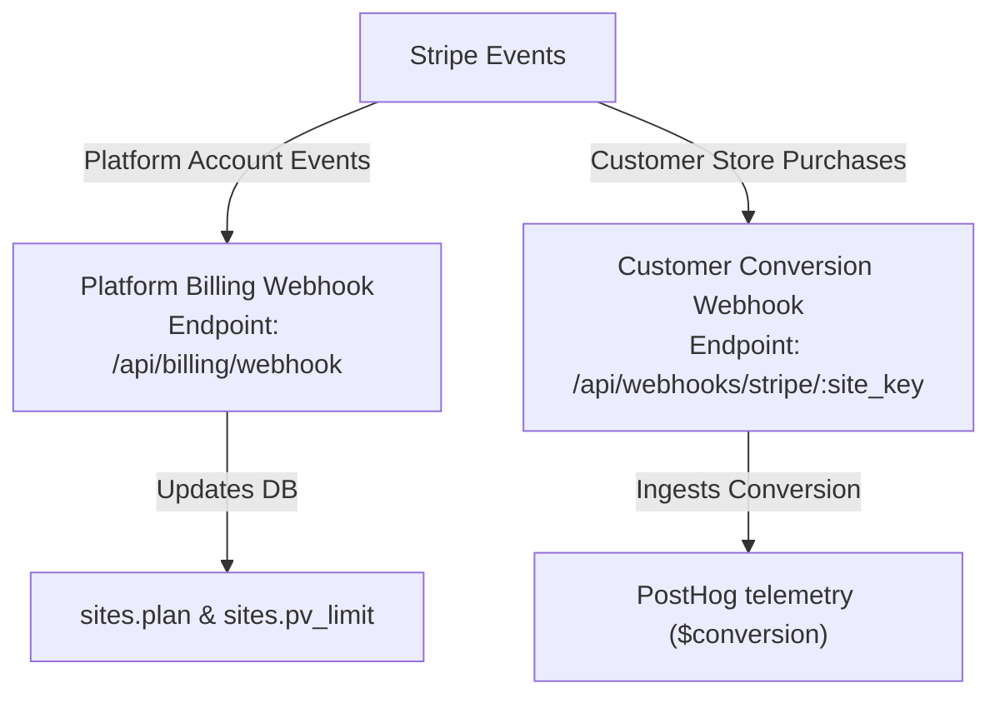

# SourceTrack Billing Checkout & Stripe Test-Mode QA Map

> [!IMPORTANT]
> **OPERATIONAL DISCLAIMER:** This document maps the Stripe billing integration architecture, verification checkpoints, and test-mode operations policies of the SourceTrack platform. Production Stripe keys must never be used for QA testing, and real payments must never be generated during local or staging verification.

---

## 1. Billing Route & Auth Inventory

| Route | Method | Description | Auth & Middleware Requirements |
| :--- | :--- | :--- | :--- |
| `/api/billing/create-checkout` | `POST` | Generates a Stripe Checkout Session URL for subscription purchase. | `requireUserAuth`, `validateSiteKey`, `requireSiteMembership` |
| `/api/billing/portal` | `POST` | Generates a Stripe Customer Billing Portal Session URL for subscription management. | `requireUserAuth`, `validateSiteKey`, `requireSiteMembership` |
| `/api/billing/status` | `GET` | Retrieves active plan status, pageview limits, and list of price configurations. | `requireUserAuth`, `validateSiteKey`, `requireSiteMembership` |
| `/api/billing/webhook` | `POST` | Receives platform subscription lifecycle events from Stripe. | Stripe Signature Verification (`stripe-signature` header) + Raw Request Body |

---

## 2. Stripe Environment Variables & Price Mappings

### Required Environment Variables
- `STRIPE_SECRET_KEY`: Backend Stripe API key (must start with `sk_test_` in development/staging; `sk_live_` in production).
- `STRIPE_PUBLISHABLE_KEY`: Frontend Vite config key (must start with `pk_test_` in development/staging; `pk_live_` in production).
- `STRIPE_WEBHOOK_SECRET`: Signature secret for the platform subscription webhook (`/api/billing/webhook`).

### Price ID Mappings
Price configurations are mapped to plans in `api/routes/billing.js` (`getPriceMap()`):

- **Canonical Price Variables:**
  - `STRIPE_PRICE_ID_STARTER` $\rightarrow$ `'starter'`
  - `STRIPE_PRICE_ID_GROWTH` $\rightarrow$ `'growth'`
  - `STRIPE_PRICE_ID_SCALE` $\rightarrow$ `'scale'`

- **Legacy Fallback Variables:**
  - `STRIPE_PRICE_ID_PRO` $\rightarrow$ `'growth'`
  - `STRIPE_PRICE_ID_BUSINESS` $\rightarrow$ `'scale'`
  - `STRIPE_PRICE_ID_AGENCY` $\rightarrow$ `'scale'`
  - `STRIPE_PRICE_ID` $\rightarrow$ `'growth'` (Global fallback if no price matches)

---

## 3. Webhook Path Separation

To prevent cross-routing errors, operators must configure the correct webhook endpoints in the appropriate Stripe dashboard consoles:

1. **Platform Billing Webhook (`/api/billing/webhook`)**
   - **Configuration:** Set up in the **SourceTrack Stripe Merchant Dashboard**.
   - **Event Types:** `checkout.session.completed`, `customer.subscription.updated`, `customer.subscription.deleted`, `invoice.payment_succeeded`, `invoice.payment_failed`.
   - **Purpose:** Updates internal user site plans and pageview limits.

2. **Customer Conversion Webhook (`/api/webhooks/stripe/:site_key`)**
   - **Configuration:** Configured by **customer merchants** inside their own Stripe accounts (or automated setup guides).
   - **Event Types:** `checkout.session.completed` only.
   - **Purpose:** Telemetry conversion event ingestion mapped to visitor identities.

---

## 4. Manual Test-Mode QA Checklists

### Checkout Flow Verification Checklist
- [ ] Verify that navigating to `/billing` as a logged-in user displays the appropriate upgrade cards.
- [ ] Select a paid tier (Starter, Growth, or Scale) and click "Upgrade". Verify that the system fetches a valid URL from `POST /api/billing/create-checkout` and redirects to the `checkout.stripe.com` test page.
- [ ] Complete a checkout in Stripe test mode using a standard test card (e.g., `4242 4242 4242 4242`).
- [ ] Verify that Stripe redirects the browser back to the success URL (`/billing?upgrade=success`).
- [ ] Verify that the database updates the target site row: `plan` changes to the upgraded plan, `stripe_customer_id` is populated, and `stripe_subscription_id` is stored.
- [ ] Verify that the `/billing` dashboard page now reflects the new plan name and updated pageview limits.

### Customer Billing Portal Checklist
- [ ] On `/billing`, verify that the "Manage Subscription" button is visible for users on paid plans.
- [ ] Click the button and verify it posts to `/api/billing/portal`, returning a portal session URL, and redirects the browser to `billing.stripe.com` test portal.
- [ ] Verify that the portal lists the correct billing history and current subscription plan.
- [ ] Click "Return" inside the Stripe portal and verify that the browser is safely redirected back to the `/billing` dashboard page.

---

## 5. Subscription Lifecycle & Failure Behaviors

### Upgrade / Downgrade Lifecycle
- Changes inside the Stripe Customer Portal trigger `customer.subscription.updated` webhooks.
- If the subscription is active or trialing, the backend updates the site row's `plan` to match the price ID, and sets the `pv_limit` based on price metadata.
- If the subscription status is unpaid or paused, the plan status is updated to `'inactive'`.

### Cancellation
- When a user cancels their subscription in the portal, Stripe dispatches a `customer.subscription.deleted` webhook.
- The webhook handler updates the site's `plan` to `'inactive'` and sets `pv_limit` to `0`.

### Payment Failure
- On receipt of `invoice.payment_failed`, the backend inspects the failed attempt counter:
  - If `attempt_count` < 3, the backend prints a warning and waits for Stripe's retry cycles.
  - If `attempt_count` $\ge$ 3, the backend suspends the site, setting `plan` to `'inactive'` and `pv_limit` to `0`.

---

## 6. Safety & Configuration Constraints

### Return URL Safety Notes
- Return URL safety depends on the backend constructing success/cancel URLs from trusted configured origins, not user-controlled input. This must be documented and verified in test mode.
- Users must only request checkout/portal sessions for sites they own or belong to, which is validated by the `requireSiteMembership` middleware.

### Stripe Mode Alignment Warning
> [!CAUTION]
> There is no hardcoded live/test distinction in code; mode safety depends entirely on environment variables. This is acceptable only if operators never mix `sk_live` keys with test price IDs or test webhook secrets. The runbook must document this as a P0 operational requirement.

### Price Metadata `pv_limit` Requirement
- The platform webhook extracts custom limits from the Stripe price object's metadata. Operators **must** attach a `pv_limit` key (e.g. `pv_limit` $\rightarrow$ `"100000"`) when creating prices in both test and production Stripe dashboards. Without this key, the system falls back to the plan's default pageview cap.

---

## 7. Remaining Billing Risks & Gaps

### P1: Webhook Idempotency restart-loss
- The webhook uses an in-memory `NodeCache` (`_seenStripeEvents`) to deduplicate event dispatches. If the API container recycles, this cache is wiped. While Stripe updates are idempotent, rapid duplicate retries immediately following a deploy could cause redundant database update operations.
- *Mitigation:* Ensure DB updates use conditional UPSERTs where applicable or accept redundant lightweight writes.

### P2: Trial-to-Paid Stepper UI State
- Downgrades or upgrades that change limits dynamically do not force a browser cache refresh on the client dashboard until the page is reloaded.
- *Mitigation:* Documented under standard browser cache limitations; client-side refetch is triggered on focus or layout transitions.
