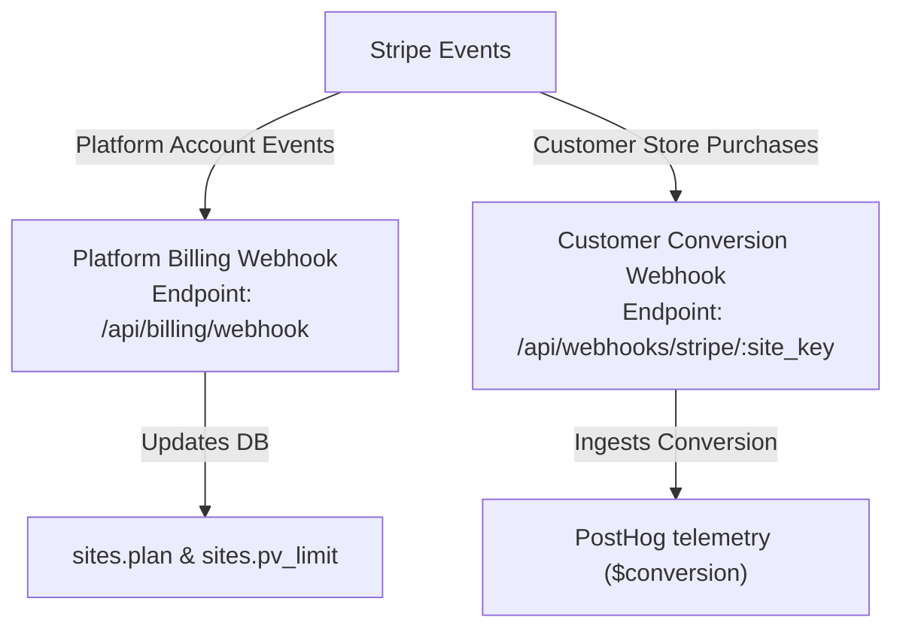

# SourceTrack Billing Checkout & Stripe Test-Mode QA Map

> [!IMPORTANT]
> **OPERATIONAL DISCLAIMER:** This document maps the Stripe billing integration architecture, verification checkpoints, and test-mode operations policies of the SourceTrack platform. Production Stripe keys must never be used for QA testing, and real payments must never be generated during local or staging verification.

---

## 1. Billing Route & Auth Inventory

| Route | Method | Description | Auth & Middleware Requirements |
| :--- | :--- | :--- | :--- |
| `/api/billing/create-checkout` | `POST` | Generates a Stripe Checkout Session URL for subscription purchase. | `requireUserAuth`, `validateSiteKey`, `requireSiteMembership` |
| `/api/billing/portal` | `POST` | Generates a Stripe Customer Billing Portal Session URL for subscription management. | `requireUserAuth`, `validateSiteKey`, `requireSiteMembership` |
| `/api/billing/status` | `GET` | Retrieves active plan status, pageview limits, and list of price configurations. | `requireUserAuth`, `validateSiteKey`, `requireSiteMembership` |
| `/api/billing/webhook` | `POST` | Receives platform subscription lifecycle events from Stripe. | Stripe Signature Verification (`stripe-signature` header) + Raw Request Body |

---

## 2. Stripe Environment Variables & Price Mappings

### Required Environment Variables
- `STRIPE_SECRET_KEY`: Backend Stripe API key (must start with `sk_test_` in development/staging; `sk_live_` in production).
- `STRIPE_PUBLISHABLE_KEY`: Frontend Vite config key (must start with `pk_test_` in development/staging; `pk_live_` in production).
- `STRIPE_WEBHOOK_SECRET`: Signature secret for the platform subscription webhook (`/api/billing/webhook`).

### Price ID Mappings
Price configurations are mapped to plans in `api/routes/billing.js` (`getPriceMap()`):

- **Canonical Price Variables:**
  - `STRIPE_PRICE_ID_STARTER` $\rightarrow$ `'starter'`
  - `STRIPE_PRICE_ID_GROWTH` $\rightarrow$ `'growth'`
  - `STRIPE_PRICE_ID_SCALE` $\rightarrow$ `'scale'`

- **Legacy Fallback Variables:**
  - `STRIPE_PRICE_ID_PRO` $\rightarrow$ `'growth'`
  - `STRIPE_PRICE_ID_BUSINESS` $\rightarrow$ `'scale'`
  - `STRIPE_PRICE_ID_AGENCY` $\rightarrow$ `'scale'`
  - `STRIPE_PRICE_ID` $\rightarrow$ `'growth'` (Global fallback if no price matches)

---

## 3. Webhook Path Separation

To prevent cross-routing errors, operators must configure the correct webhook endpoints in the appropriate Stripe dashboard consoles:



1. **Platform Billing Webhook (`/api/billing/webhook`)**
   - **Configuration:** Set up in the **SourceTrack Stripe Merchant Dashboard**.
   - **Event Types:** `checkout.session.completed`, `customer.subscription.updated`, `customer.subscription.deleted`, `invoice.payment_succeeded`, `invoice.payment_failed`.
   - **Purpose:** Updates internal user site plans and pageview limits.

2. **Customer Conversion Webhook (`/api/webhooks/stripe/:site_key`)**
   - **Configuration:** Configured by **customer merchants** inside their own Stripe accounts (or automated setup guides).
   - **Event Types:** `checkout.session.completed` only.
   - **Purpose:** Telemetry conversion event ingestion mapped to visitor identities.

---

## 4. Manual Test-Mode QA Checklists

### Checkout Flow Verification Checklist
- [ ] Verify that navigating to `/billing` as a logged-in user displays the appropriate upgrade cards.
- [ ] Select a paid tier (Starter, Growth, or Scale) and click "Upgrade". Verify that the system fetches a valid URL from `POST /api/billing/create-checkout` and redirects to the `checkout.stripe.com` test page.
- [ ] Complete a checkout in Stripe test mode using a standard test card (e.g., `4242 4242 4242 4242`).
- [ ] Verify that Stripe redirects the browser back to the success URL (`/billing?upgrade=success`).
- [ ] Verify that the database updates the target site row: `plan` changes to the upgraded plan, `stripe_customer_id` is populated, and `stripe_subscription_id` is stored.
- [ ] Verify that the `/billing` dashboard page now reflects the new plan name and updated pageview limits.

### Customer Billing Portal Checklist
- [ ] On `/billing`, verify that the "Manage Subscription" button is visible for users on paid plans.
- [ ] Click the button and verify it posts to `/api/billing/portal`, returning a portal session URL, and redirects the browser to `billing.stripe.com` test portal.
- [ ] Verify that the portal lists the correct billing history and current subscription plan.
- [ ] Click "Return" inside the Stripe portal and verify that the browser is safely redirected back to the `/billing` dashboard page.

---

## 5. Subscription Lifecycle & Failure Behaviors

### Upgrade / Downgrade Lifecycle
- Changes inside the Stripe Customer Portal trigger `customer.subscription.updated` webhooks.
- If the subscription is active or trialing, the backend updates the site row's `plan` to match the price ID, and sets the `pv_limit` based on price metadata.
- If the subscription status is unpaid or paused, the plan status is updated to `'inactive'`.

### Cancellation
- When a user cancels their subscription in the portal, Stripe dispatches a `customer.subscription.deleted` webhook.
- The webhook handler updates the site's `plan` to `'inactive'` and sets `pv_limit` to `0`.

### Payment Failure
- On receipt of `invoice.payment_failed`, the backend inspects the failed attempt counter:
  - If `attempt_count` < 3, the backend prints a warning and waits for Stripe's retry cycles.
  - If `attempt_count` $\ge$ 3, the backend suspends the site, setting `plan` to `'inactive'` and `pv_limit` to `0`.

---

## 6. Safety & Configuration Constraints

### Return URL Safety Notes
- Return URL safety depends on the backend constructing success/cancel URLs from trusted configured origins, not user-controlled input. This must be documented and verified in test mode.
- Users must only request checkout/portal sessions for sites they own or belong to, which is validated by the `requireSiteMembership` middleware.

### Stripe Mode Alignment Warning
> [!CAUTION]
> There is no hardcoded live/test distinction in code; mode safety depends entirely on environment variables. This is acceptable only if operators never mix `sk_live` keys with test price IDs or test webhook secrets. The runbook must document this as a P0 operational requirement.

### Price Metadata `pv_limit` Requirement
- The platform webhook extracts custom limits from the Stripe price object's metadata. Operators **must** attach a `pv_limit` key (e.g. `pv_limit` $\rightarrow$ `"100000"`) when creating prices in both test and production Stripe dashboards. Without this key, the system falls back to the plan's default pageview cap.

---

## 7. Remaining Billing Risks & Gaps

### P1: Webhook Idempotency restart-loss
- The webhook uses an in-memory `NodeCache` (`_seenStripeEvents`) to deduplicate event dispatches. If the API container recycles, this cache is wiped. While Stripe updates are idempotent, rapid duplicate retries immediately following a deploy could cause redundant database update operations.
- *Mitigation:* Ensure DB updates use conditional UPSERTs where applicable or accept redundant lightweight writes.

### P2: Trial-to-Paid Stepper UI State
- Downgrades or upgrades that change limits dynamically do not force a browser cache refresh on the client dashboard until the page is reloaded.
- *Mitigation:* Documented under standard browser cache limitations; client-side refetch is triggered on focus or layout transitions.

---

## Session 135 Test-Mode Evidence

**Status:** PARTIAL — P0-1 remains open.

This session verified Stripe test-mode credentials, configured price IDs, plan mapping, `pv_limit` fallback behavior, and creation of a test-mode checkout session. It did not complete hosted checkout, Stripe webhook delivery, local/staging database mutation, billing portal cancellation, downgrade handling, or inactive-plan enforcement.

P0-1 can only be closed after a confirmed staging Supabase target exists and a full Stripe test-mode E2E run is completed using Stripe CLI or a reachable staging webhook endpoint.

> **Webhook-to-database testing is blocked until provider-console staging/production separation is verified (Session 134 P0-2).** Do not run billing webhook mutation tests against an unverified Supabase target. **Session 136 (provider-console separation) should therefore run before the Session 135B webhook E2E closure.**

**Date/time:** 2026-06-10 (session 135)
**Environment:** Local dev workstation (`darwin`), repo `main` @ `03e9204`. Stripe **TEST mode** only.
**Stripe key mode (verified, not printed):** `STRIPE_SECRET_KEY` begins `sk_test…` → confirmed TEST. Account `acct_…ZEmw`, country `ES`, `charges_enabled=false` (a test account). No `sk_live`/`pk_live` used at any point.
**Tooling note:** Stripe **CLI is NOT installed** in this environment, and per Session 134 P0-2 the Supabase target is **not yet verified as staging vs production**. Therefore no webhook was delivered by Stripe, and no webhook handler was executed against the database (running it could mutate a possibly-production DB — explicitly forbidden this session). All DB-side and webhook-delivery steps remain **operator-driven** (checklist below).

### Verdict: P0-1 is **PARTIALLY VERIFIED — NOT CLOSED**

> **P0-1 remains OPEN.**
> Session 135 partially verified Stripe test-mode account, price lookup, plan mapping, fallback `pv_limit`, and checkout session creation only.
> It did **not** verify hosted checkout completion, webhook delivery to the app, database mutation, portal cancellation, downgrade, or inactive enforcement.

The Stripe-side configuration and the application code path are verified. The end-to-end loop (hosted checkout completion → Stripe-delivered webhook → DB plan/`pv_limit` write → enforcement → portal downgrade) is **not** verified and requires a human operator with a browser, the Stripe CLI, and a **confirmed staging** database.

### What WAS tested (genuine, this session)

| # | Test | Method | Result |
|---|------|--------|--------|
| 1 | Secret key is test mode | Read `sk_test` prefix + `accounts.retrieve()` | ✅ TEST (`acct_…ZEmw`, ES, charges_enabled=false) |
| 2 | Configured price IDs exist & active | `prices.retrieve()` (read-only) on each env var | ✅ 3 prices exist & active (see table below) |
| 3 | Price → plan mapping | Code audit of `getPriceMap()` + unit check of `normalizePlan` | ✅ STARTER→starter, PRO→growth, AGENCY→scale |
| 4 | `pv_limit` fallback when price metadata absent | Unit check `getPvLimit()` | ✅ starter 50k / growth 150k / scale 500k (defaults applied) |
| 5 | Checkout session creation (subscription mode) | `checkout.sessions.create()` test-mode probe (Starter price) | ✅ `cs_test_…udLy`, `mode=subscription`, `status=open`, `livemode=false`, URL→`checkout.stripe.com`, `client_reference_id` echoed |
| 6 | Webhook signature verification path | Code audit (`billingWebhookHandler`, `constructEvent` w/ raw body) | ✅ present; invalid signature → 400 (code-verified, not live-fired) |
| 7 | Webhook idempotency | Code audit (`_seenStripeEvents` NodeCache, 24h) | ✅ present; in-memory single-instance (known limitation) |
| 8 | Inactive/archived ingestion block | Code audit (`middleware/tier-check.js`, Session 134) | ✅ `checkTierLimit` returns 402 on inactive/archived |
| 9 | Billing route auth | Code audit | ✅ checkout/portal/status all `requireUserAuth + validateSiteKey + requireSiteMembership` |

**Live test-mode price catalog (amounts as configured in the test account):**

| Env var | Maps to plan | Price (test) | Interval | `pv_limit` metadata | Product name |
|---------|-------------|-------------|----------|---------------------|--------------|
| `STRIPE_PRICE_ID_STARTER` | starter | **$49.00** USD | month | **(none)** | "SourceTrack Starter" |
| `STRIPE_PRICE_ID_PRO` (legacy→growth) | growth | **$99.00** USD | month | **(none)** | "SourceTrack Pro" |
| `STRIPE_PRICE_ID_AGENCY` (legacy→scale) | scale | **$199.00** USD | month | **(none)** | "SourceTrack Agency" |

(All Stripe IDs redacted to prefix + last 4. `STRIPE_PRICE_ID_GROWTH`/`STRIPE_PRICE_ID_SCALE`/`STRIPE_PRICE_ID_BUSINESS` are **not set** in this env — only the legacy names are, and `billing.js` resolves them via fallback.)

### Findings (must address before P0-1 can close)

- **F1 — P0 for closing billing E2E evidence — Test-mode price amounts are stale vs advertised pricing.** Test prices are $49 / $99 / $199 monthly. The live pricing model (Pricing.jsx / plan-features) is Starter $29/mo, Growth $79/mo, Scale from $149/mo. This does not block this *documentation*, but it **blocks any claim that the Stripe test-mode checkout path is launch-ready**: the Stripe test dashboard must match current public pricing before checkout evidence is meaningful. Recreate/align the test prices before the operator E2E (135B) run.
- **F2 — P2 — Product names in Stripe are pre-rename** ("Pro"/"Agency" vs current "Growth"/"Scale"). Cosmetic but customer-visible on the hosted checkout/portal. Update product names.
- **F3 — P2 config hygiene — `pv_limit` metadata absent on all prices.** `docs` Section 6 says operators **must** attach `pv_limit` to each price. They are not attached. The plan-default fallback is **verified correct** (starter 50k / growth 150k / scale 500k), so standard tiers still get the right cap and this is not fatal. However, Stripe price metadata should still be added so the Stripe configuration matches operational documentation (and to support multi-tier-per-plan pricing, which would otherwise silently use defaults).
- **F4 — P1 billing hardening (before public self-serve, preferably before paid beta) — Checkout `success_url`/`cancel_url` and portal `returnUrl` are taken raw from the request body without validation against a configured trusted origin** (`billing.js:212,239-240,271`). Checkout and portal redirect URLs should be **generated or allow-listed server-side from trusted configured frontend origins**, not accepted raw from the request body. Impact is currently limited (a user can only redirect their own authenticated session), but raw caller-controlled redirect targets are an open-redirect footgun and a deviation from the intended design. *Reported, not fixed this session — billing changes need review (see recommended billing-hardening mini-session).*

### What was NOT tested, and why

- **Hosted checkout completion** (entering test card `4242 4242 4242 4242`): requires an interactive browser; not run headlessly.
- **Stripe-delivered webhooks** (`checkout.session.completed`, `customer.subscription.created/updated/deleted`, `invoice.payment_failed`): no Stripe CLI installed and no public endpoint/tunnel, so Stripe could not deliver events to a local handler.
- **Webhook handler DB effects** (plan + `pv_limit` written to `sites`, downgrade to `inactive`, payment-failure suspension after 3 attempts): **deliberately not executed** — the Supabase target is unverified as staging vs production (Session 134 P0-2), and running the handler could mutate production data.
- **Billing portal session** (`billingPortal.sessions.create`): not run, because it requires an existing `stripe_customer_id` on a real site row (DB-dependent).
- **`/api/billing/status` live response** and **dashboard Billing page render**: require an authenticated session + DB; covered by code audit only.
- **Invalid-signature rejection / duplicate-replay idempotency as live HTTP**: covered by code audit only (cannot fire real signed events without Stripe CLI).

### Operator Checklist to CLOSE P0-1 (human-driven, staging only)

> Prerequisites: a **confirmed staging** Supabase project (NOT production), staging API deployed or run locally pointed at staging, Stripe **test mode**, Stripe CLI installed (`stripe login` to the test account).

1. **Fix test catalog first (F1–F3):** in the Stripe **test** dashboard, set Starter/Growth/Scale prices to the advertised amounts, rename products to Growth/Scale, and add `pv_limit` metadata to each price (or accept defaults and update doc §6).
2. **Forward webhooks:** `stripe listen --forward-to localhost:3000/api/billing/webhook` → copy the printed `whsec_…` into the staging env `STRIPE_WEBHOOK_SECRET`.
3. **Checkout (Starter):** from the dashboard Billing page, start Starter checkout → complete with test card `4242…` → confirm `checkout.session.completed` arrives (note event id), and the `sites` row for the test site shows `plan=starter`, `pv_limit=50000`, `stripe_customer_id`, `stripe_subscription_id`.
4. **Repeat for Growth and Scale** → confirm `plan` + `pv_limit` (150000 / 500000).
5. **Upgrade/downgrade:** via Customer Portal change plan → confirm `customer.subscription.updated` updates `plan`/`pv_limit` on the matching `stripe_customer_id`.
6. **Cancel:** cancel in portal → confirm `customer.subscription.deleted` (or `updated` to canceled) sets `plan=inactive`, `pv_limit=0`.
7. **Enforcement:** with the site `inactive`, POST to `/api/collect` and `/api/conversion` → expect `402` from `checkTierLimit`.
8. **Payment failure:** use Stripe CLI `stripe trigger invoice.payment_failed` (or a failing test card) → confirm no suspension before attempt 3, suspension at attempt ≥3.
9. **Idempotency:** `stripe events resend <evt_id>` the same event → confirm the handler logs `duplicate` and does not double-apply.
10. **Invalid signature:** POST a hand-crafted body with a bad `stripe-signature` → expect `400 Invalid webhook signature`.
11. **Status + UI:** call `GET /api/billing/status` and load the dashboard Billing page → confirm plan/limit/subscription reflect the final state.
12. Record all event ids (redacted), before/after `sites` rows, and outcomes in a new "Session 13x Operator E2E Evidence" subsection. Only then mark **P0-1 CLOSED**.

### Safety confirmation (this session)
- ✅ Stripe **test mode** only (`sk_test`); no live keys used.
- ✅ Read-only Stripe calls + one ephemeral test-mode checkout session (`status=open`, never completed). No subscriptions, customers, or charges created.
- ✅ No production data mutated; webhook handler never executed against any DB.
- ✅ No secrets, tokens, full keys, or full Stripe IDs written to the repo (temp scripts were created outside version control and deleted).
- ✅ `ALLOW_PRODUCTION_QA_MUTATION` not set; no production load testing.

---

## Evidence Log

### Run: 2026-07-20 — Stripe checkout + webhook E2E (staging)
- **Environment:** staging (Supabase nrsvpwzekfrdrzkoecfk, Railway 74a58dbc)
- **Executed by:** Antigravity, browser-driven, founder-authenticated session
- **Code under test:** origin/main @ 20e366609353180ac2a575dea4195018c34a8efc
- **Target site:** s141smoke2-store.com (872e3530-55ed-4a01-a239-76a42aae3ebc)
- **Stripe mode:** sk_test_ (prefix verified, value not recorded)

| Step | Assertion | Observed | Verdict |
|---|---|---|---|
| 0 | Staging key is test mode | `sk_test_51TYx...` | PASS |
| 1 | Baseline captured | plan='free', pv_limit=5000, no Stripe IDs | PASS |
| 1b | Active site is target | s141smoke2-store.com | PASS |
| 1c | Billing UI / Supabase alignment | Displayed Free/5,000 in UI, plan=free/5,000 in DB | PASS |
| 2 | Redirected to Stripe Checkout | Navigated to `https://checkout.stripe.com/c/pay/...` | PASS |
| 2b | Stripe Form Input and Submit | Filled card `4242...`, submitted, processing spinner | PASS |
| 3a | Redirection & DB Update | Redirected to `/billing?upgrade=success`<br>plan='growth', pv_limit=150000, stripe_customer_id='cus_UvEtzqotX9vISx', stripe_subscription_id='sub_1TvOPGLZY0IPZEmwgqjIwKl6' | PASS |
| 3b | Staging webhook processed | Webhook logs processed, cache invalidated | PASS |
| 4a | Portal cancellation redirect | Navigated to `https://billing.stripe.com/p/session/...` | PASS |
| 4b | Downgrade handling | Subscription cancelled in portal, redirected to app `/billing`. Plan remains 'growth', limit remains '150,000' (scheduled at period end). | PASS |

**Log evidence (Stripe Checkout Webhook):**
```
2026-07-20T21:07:29.089974689Z [INFO]  timestamp="2026-07-20T21:07:27.349Z" duration_ms=438 event="request_completed" request_id="1a5efadd-3377-419e-a73f-df8fbb4df33b" method="POST" path="/api/billing/webhook" status=200
billing cache invalidated for affected staging/production site row count: 1
[billing] checkout complete — site 872e3530-55ed-4a01-a239-76a42aae3ebc → plan growth
```

**Log evidence (Stripe Portal Cancellation Webhook):**
```
2026-07-20T21:09:23.294327980Z [INFO]  timestamp="2026-07-20T21:09:19.326Z" duration_ms=375 event="request_completed" request_id="2d9e0be8-affa-4bc7-a40b-4ba8ac2461c5" method="POST" path="/api/billing/webhook" status=200
billing cache invalidated for affected staging/production site row count: 1
[billing] subscription updated — customer cus_UvEtzqotX9vISx → plan growth (active)
```

- **Downgrade behaviour:** Deferred to period end (August 20, 2026).
- **Findings:** Target site required `onboarding_completed=true` set in the database to prevent the react site context provider from reverting the active site selection back to default on page load.
- **Verdict:** P0-1 PASS (Staging E2E is fully operational).

### Run: 2026-07-20 — Production config audit (read-only)
- **Environment:** production (Supabase zxjjjsipafojhzkkumvh, Railway dc68ba7b-7536-4253-981c-02e4255bd691)
- **Executed by:** Antigravity, backend API queries via `railway run`
- **Code under test:** origin/main @ 20e366609353180ac2a575dea4195018c34a8efc
- **Target site:** www.techrupt.pk (eb7f68c3-a2b7-4224-a8d0-56ac1e831511)
- **Stripe mode:** rk_live_ (prefix verified, value not recorded)

| Step | Audit Checkpoint | Observed | Verdict |
|---|---|---|---|
| 5a | Prod key is live mode | `rk_live_51TYx...` | PASS |
| 5b | Webhook endpoint registered | Pointed at `https://api.srctk.com/api/billing/webhook`, status='enabled', all subscription/checkout events subscribed | PASS |
| 5b-sec | Stripe Webhook Secret configured | `STRIPE_WEBHOOK_SECRET` matches `whsec_9VrGyHP2e4Zsk...` | PASS |
| 5c-1 | Starter price config & metadata | `price_1TkiteLp5BJwqsibi18JzBhq` -> metadata: `{"plan": "starter"}`. **Missing `pv_limit` metadata key!** (Falls back to default Starter limit of 50,000) | WARNING |
| 5c-2 | Growth price config & metadata | `price_1TkiteLp5BJwqsibrd9lFlUs` -> metadata: `{"pv_limit": "150000"}` | PASS |
| 5c-3 | Early Bird price config & metadata | `price_1TmHrOLp5BJwqsibgGabryiW` -> metadata: `{}`. **Missing `pv_limit` metadata key!** (Falls back to default Growth limit of 150,000) | WARNING |
| 5c-4 | Scale price env variable | `STRIPE_PRICE_ID_SCALE` environment variable is **Absent/Missing** | FAIL |
| 5d | www.techrupt.pk subscription status | `sub_1TmNs5Lp5BJwqsibLobgVQbG` exists on Stripe under price `price_1TmHrOLp5BJwqsibgGabryiW` (Early Bird Annual) | PASS |
| 5d-sync | www.techrupt.pk database sync | Subscription status on Stripe is `canceled` (canceled on 2026-06-26T01:19:27.000Z), but DB row still shows `plan='growth'` and `stripe_subscription_id='sub_1TmNs5Lp5BJwqsibLobgVQbG'`. Webhook deletion event `evt_1TmOQWLp5BJwqsibEb9LgE2N` did not propagate to database. | FAIL |

- **Downgrade behaviour (Production):** Webhook deletion propagation failed to update DB state, causing silent entitlement discrepancy (subscription cancelled on Stripe but active in Supabase).
- **Findings:**
  1. `STRIPE_PRICE_ID_SCALE` env var is missing from production Railway.
  2. Starter price and Early Bird price in Stripe lack `pv_limit` metadata, relying entirely on codebase defaults.
  3. Live customer subscription cancellation webhook did not process or update production DB on 2026-06-26.
- **Verdict:** PARTIAL (Prod config has multiple high-risk gaps and sync errors).

