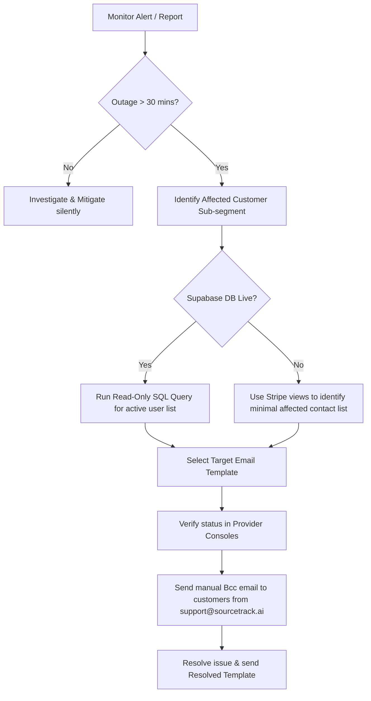

# SourceTrack Customer-Facing Incident Communication Plan

This document establishes the policies, checklists, and templates for communicating service interruptions, ingestion delays, billing issues, and email delivery incidents to SourceTrack customers during the paid beta phase.

---

## 1. Status Page Reality

SourceTrack does not operate a public-facing status page (e.g., Statuspage.io, Instatus) during the paid beta.
- **Rationale:** The current customer count and traffic volume do not justify the cost or overhead of maintaining a dedicated, isolated external status infrastructure.
- **Implication:** All customer communication regarding outages or degraded operations is handled via targeted, manual email notification sent by operators from `support@sourcetrack.ai`.

---

## 2. Customer Support Entry Points

During paid beta, customer support is strictly email-based and routed to a single address: `support@sourcetrack.ai`.
Support links are present in the following locations within the app:
* **Dashboard Footer:** Mailto link to `support@sourcetrack.ai`.
* **Billing Page (`/billing`):** Inline support footer for billing and refund questions.
* **Settings Page (`/settings`):** "Support & Feedback" card.
* **Tracking Snippet Page (`/snippet`):** Setup help and troubleshooting support mailto links.
* **Onboarding Verification step (`/onboarding` step 6):** Script verification failure troubleshooting fallback link.

---

## 3. Incident Severity & Customer-Facing Definitions

We map system incident severities to customer-facing communication requirements:

| Severity | Technical Definition | Customer-Facing Impact | Communication Action |
| :--- | :--- | :--- | :--- |
| **P0** | Core platform offline, Express API returns 5xx, database connections exhausted, or tracking/ingestion completely down. | Dashboard inaccessible, script telemetry lost, or Stripe webhook checks failing globally. | **Notify affected active beta users** if the outage exceeds the 30-minute threshold. |
| **P1** | Background tasks, attribution sync, or report crons fail. Tracking pixel is operational. | Nightly attribution reports delayed or ad platform spend sync failing. | **No active notification** unless resolution takes > 24 hours. Address inquiries reactively. |
| **P2** | Cosmetic UI bugs, documentation link typos, or dashboard card alignments. | No functional impact on tracking, attribution, or billing. | **Never notify.** Resolve in next standard deploy. |

---

## 4. When to Notify (The 30-Minute Boundary)

If a **P0 incident** remains unresolved for **longer than 30 minutes**, operators must initiate the customer notification process.
- **Do not notify immediately:** Short blips (e.g., container recycles, database restarts) that resolve in under 5 minutes do not require emails.
- **Do not wait longer than 30 minutes:** Customers whose sites actively capture ad-attribution data must be notified early to prevent trust loss.

---

## 5. Target List Construction (Who Receives Updates)

During paid beta, operators should notify affected active beta customers. If the incident is global, notify all active paying/trialing beta customers.

Customer lists must be built using read-only sources only, such as Supabase read-only queries or Stripe customer/subscription views. If Supabase is unavailable, Stripe may be the fallback source for billing/customer contact lookup.

### Query 1: Active Users List (Supabase SQL Editor - Read-Only)
If the database is accessible, retrieve the list of active customer email addresses:
```sql
SELECT DISTINCT u.email
FROM company_members cm
JOIN auth.users u ON u.id = cm.user_id
JOIN sites s ON s.company_id = cm.company_id
WHERE s.status = 'active';
```

### Query 2: Affected Site Owners List (Supabase SQL Editor - Read-Only)
If only a specific subset of sites is affected by a localized ingestion failure:
```sql
SELECT DISTINCT u.email
FROM company_members cm
JOIN auth.users u ON u.id = cm.user_id
JOIN sites s ON s.company_id = cm.company_id
WHERE s.site_key = 'st_AFFECTED_KEY_HERE';
```

### Fallback: Stripe Dashboard (If Supabase is Offline)
If the primary Supabase database is unreachable:
1. Log in to the **Stripe Dashboard**.
2. Navigate to **Customers**.
3. Filter by active subscriptions (`Starter`, `Growth`, or `Scale` product plans).
4. Use Stripe customer/subscription views to identify the minimal affected paying or trialing customer contact list needed for the incident update.

> [!WARNING]
> Operators must never run mutating SQL statements (`UPDATE`, `DELETE`) or execute arbitrary scripts against the production database to extract user lists.

---

## 6. Wording Boundaries (Strict Disclaimers)

To set realistic expectations and protect the business legally, operators must adhere to these wording guidelines:

### Pre-Approved Wording (Honest & Non-Promissory)
- "We are investigating degraded tracking or dashboard availability."
- "We have identified an issue affecting [specific component] and are working to restore service."
- "We believe the issue is mitigated and tracking has resumed."
- "We will follow up if we find customer-visible data impact."

### Prohibited Wording (Never Use)
- **Do NOT claim guaranteed uptime or SLAs:** Do not use "guaranteed uptime" or "SLA-backed".
- **Do NOT promise 24/7 monitoring:** Do not state that the platform is monitored "24/7" or round-the-clock.
- **Do NOT promise automatic refunds or compensation:** Never state that "compensation is guaranteed" or "refunds will be issued automatically."
- **Do NOT promise full resolution for all parties:** Avoid stating "fully resolved for everyone" or "guaranteed restored" until individual data flows have been verified.

---

## 7. Incident Email Templates

All updates sent to customers must be short, honest, and non-promissory. Use the appropriate template based on the incident type.

### Template A: Dashboard / API Outage (P0 Outage)
**Subject:** [SourceTrack] Monitoring degraded dashboard and tracking availability
```txt
Hello,

We are investigating degraded tracking and dashboard availability on our platform.

During this window, you may be unable to access your dashboard, and conversion tracking pixel events may fail to record. We are investigating the underlying cause and working on mitigation.

We are not currently making changes to historical dashboard records as part of this incident response. We will follow up if we find customer-visible data impact.

Thank you for your patience,
SourceTrack Support
```

### Template B: Ingestion Degraded / Delayed
**Subject:** [SourceTrack] Investigating event ingestion delay
```txt
Hello,

We are investigating degraded tracking event processing speed on the platform.

Our current checks indicate that tracking is still receiving events, but there is a delay in processing or displaying some events on your dashboard.

We are working to resolve the delay. We do not expect any action to be required on your part at this time. We will follow up if we find customer-visible data impact.

Thank you,
SourceTrack Support
```

### Template C: Webhook Processing Delay (Stripe / Shopify Sync)
**Subject:** [SourceTrack] Investigating integration webhook processing delays
```txt
Hello,

We are investigating delays in processing webhook data from Stripe and Shopify integrations.

Our current checks indicate your integration connection is still configured, but sync updates for new conversion events may be temporarily delayed on your dashboard. We are investigating the delay and will follow up if we find customer-visible data impact.

Once the delay is cleared, we expect affected dashboard stats to update. We will follow up if we find any customer-visible data impact.

Thank you,
SourceTrack Support
```

### Template D: Billing / Stripe Checkout Issue
**Subject:** [SourceTrack] Stripe billing and checkout session updates
```txt
Hello,

We are investigating an issue affecting our checkout and billing portal redirection systems.

Based on current checks, this appears limited to checkout or billing portal access. You may experience failures or error messages when upgrading plans or managing your subscription.

We are working with our payment processor to resolve this and will update you shortly.

Thank you,
SourceTrack Support
```

### Template E: Transactional Email / Report Digest Delay
**Subject:** [SourceTrack] Delay in weekly attribution reports and limit alerts
```txt
Hello,

We are investigating an issue affecting our email delivery systems.

As a result, weekly attribution digests and usage alert emails may be delayed. Based on current checks, this appears limited to email delivery.

We will continue monitoring email delivery and follow up if we find customer-visible data impact.

Thank you,
SourceTrack Support
```

### Template F: Resolved Incident
**Subject:** [SourceTrack] Service status update: Mitigated
```txt
Hello,

We believe the issue affecting [outage / ingestion / webhooks / billing / email delivery] is mitigated based on current checks.

We will follow up if we find customer-visible data impact. If you experience any ongoing issues, please reply directly to this message.

Thank you for your patience,
SourceTrack Support
```

---

## 8. Provider-Console Verification Checklist

Before sending any incident update or resolution message, operators must perform this technical verification checklist to isolate the issue:

- [ ] **Railway Console:**
  - Verify that the Express application process is not crashing or in a boot loop.
  - Review memory and CPU logs to confirm there is no node process leak.
- [ ] **Supabase Console:**
  - Confirm the API Gateway is not returning 5xx status codes.
  - Inspect Database PostgreSQL connection pool stats to ensure pools are not exhausted.
- [ ] **PostHog Console:**
  - Check the Live Events stream to verify that events are flowing from client sites.
  - Verify the ClickHouse API is responding to dashboard HogQL reporting queries.
- [ ] **Stripe Dashboard:**
  - Review the developers webhook event history to ensure events are not returning 5xx or signature errors.
- [ ] **Resend Console:**
  - Check domain deliverability status and bounce queue logs to verify Resend isn't blocking outbound messages.

---

## 9. Manual Paid-Beta Escalation Process



---

## 10. Future Recommendations

- **Public Status Page:** Deploy a public status page (e.g., hosted on a separate domain via Instatus or cache-heavy cloudflare page) only when SourceTrack moves out of paid beta or exceeds 100 paying customer organizations.
- **Sentry Integration:** Implement frontend and backend Sentry logging to catch JavaScript exceptions before customers report them via support.
- **Automated Uptime Monitor:** Set up a third-party uptime checker (e.g., Better Stack, UptimeRobot) pinging the `/health` endpoint and notifying operators immediately via Slack or pager.
