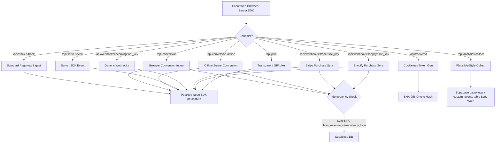
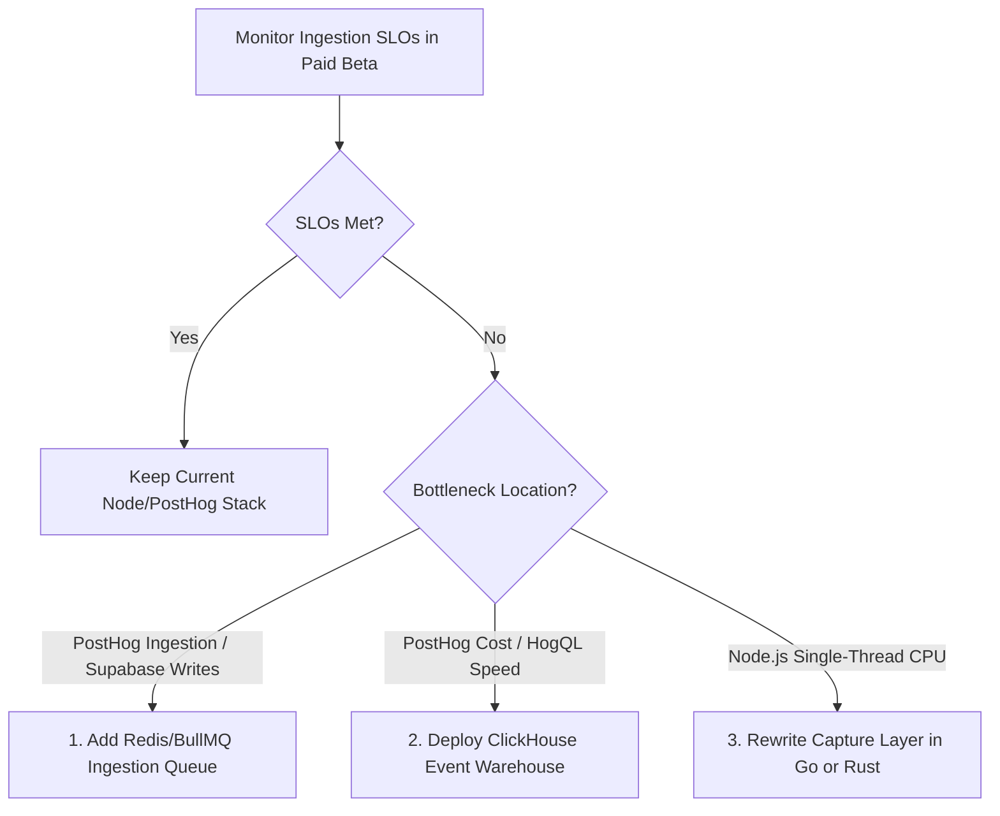

# SourceTrack Event Pipeline Ingestion Capacity Map

This document outlines the architecture, scaling limits, capacity calculations, service level objectives (SLOs), and architectural transition gates for the SourceTrack ingestion pipeline before the paid beta launch.

---

## 1. Hot Ingestion Path Map

The following endpoints handle incoming client and server-to-server traffic:

---

## 2. Ingestion Capacity Calculations

Our planning targets are structured around the following volumes:

* **Target Volume:** 50,000,000 to 100,000,000 events/month.
* **Monthly Math:**
  * **50M events/month:**
    * $\approx 1,666,667$ events/day
    * $\approx 69,444$ events/hour
    * $\approx 19.3$ events/second average
  * **100M events/month:**
    * $\approx 3,333,333$ events/day
    * $\approx 138,889$ events/hour
    * $\approx 38.6$ events/second average
* **Spike Profile Targets (Staging test limits):**
  * **200 events/second:** Realistic peak traffic during client launches or promotion windows ($12,000$ events/minute).
  * **500 events/second:** High-traffic spikes ($30,000$ events/minute).
  * **1,000 events/second:** Maximum short-burst capacity / headroom target ($60,000$ events/minute).

---

## 3. Ingestion Service Level Objectives (SLOs)

We hold the ingestion pipeline to the following performance bounds:

| Metric | Target SLO | Measurement Point |
|---|---|---|
| **Ingestion Success Rate** | $\ge 99.9\%$ | Global count of `200` & `202` response codes vs all requests (excluding client aborts) |
| **Ingestion Latency (p95)** | $< 50\text{ ms}$ | Time between Express receiving request and returning headers (excluding DB-blocking endpoints) |
| **Sync Database Endpoints (p95)** | $< 250\text{ ms}$ | Latency for offline conversions and webhook endpoints performing synchronous RPC checks |
| **Error Rate (5xx)** | $< 0.1\%$ | Ratio of internal server errors relative to total volume |

---

## 4. Current Ingestion Bottlenecks

1. **PostHog SDK In-Flight Concurrency (Fixed):**
   * **Issue:** PostHog was configured with `flushAt: 1` and `flushInterval: 0`, spawning a network request for every single event on `ph.capture`. At 1,000 events/sec, this creates 1,000 concurrent outbound connections, overloading Node's socket pool.
   * **Mitigation:** Optimized PostHog batching parameters dynamically. Production and staging default to `flushAt: 20` and `flushInterval: 10000ms`, dropping outbound network request load by $\approx 95\%$. Local dev retains immediate flushing.
2. **Synchronous Supabase Writes on Plausible-style `/api/analytics/collect`:**
   * **Issue:** Every single pageview, heartbeat, and custom event blocks the Express response thread waiting for `supabase.from('pageviews').insert(...)` or `.update(...)` to complete. This is the single highest-risk bottleneck in the system; a database lock or latency spike instantly locks up the entire Express event loop.
3. **Incompatible Webhook Rate Limiting:**
   * **Issue:** `/api/webhooks/incoming` was bound to `trackLimit` which enforces a global limit of **120 requests/minute** across all sites/clients combined. A CRM batch upload will trigger this limit instantly, blocking webhooks for all other customers.
4. **Site & Global IP Limits vs Bursts:**
   * **Issue:** The site-level ingestion rate limit of 10,000 req/min will reject traffic under a 200 events/sec single-tenant spike ($12,000$ req/min).

---

## 5. Ingestion Verification & Safety Gates

### Idempotency Review
* **Conversions:** Idempotent if `order_id` (or similar key) is provided. It combines a 24h `NodeCache` fast-path with a Supabase database RPC transaction check (`claim_revenue_idempotency_keys`) to guarantee deduplication across server restarts.
* **Pageviews & Custom Events:** At-least-once delivery only. No deduplication is performed.

### Kill-Switch Behavior & Cache Latency
* Operators can manually disable an abusive or noisy site by setting its plan to `'inactive'` or `'archived'` in Supabase.
* The auth middleware `validateSiteKey` caches site configurations for 5 minutes (`siteCache` TTL = 300s). The kill switch will take up to **5 minutes** to propagate unless the server process is restarted.
* **Bug Fix implemented:** Added early plan check gating to Stripe (`stripe-webhook.js`) and Shopify (`shopify-webhook.js`) webhook receivers to block database RPCs early if the plan is `'inactive'` or `'archived'`, protecting Postgres resources.

---

## 6. Observability & Monitoring Checklist

Verify these indicators during paid-beta operations:

* [ ] **Express 429 Logs:** Check console logs for `[rate-limit] status=429` indicators.
* [ ] **Express 500 logs:** Monitor `[track] Ingestion error:` and `Global API error:` entries in console outputs.
* [ ] **Supabase RPC Latency:** Monitor executions of `claim_revenue_idempotency_keys` in Supabase dashboard logs.
* [ ] **PostHog SDK failures:** Inspect console outputs for socket/network error reports from the `posthog-node` agent.

---

## 7. Future Architecture Decision Gates

We will transition the ingestion stack only when these concrete trigger points are reached:

### Transition Triggers:
1. **Queue/Batch Layer:** Trigger if Postgres RPC connections saturate or if PostHog API latency causes memory pool overflow.
2. **ClickHouse Event Warehouse:** Trigger if PostHog billing exceeds threshold or if multi-touch attribution HogQL dashboard queries take $>10\text{ seconds}$ to complete.
3. **Go/Rust Capture Service:** Trigger only if local node profile confirms Node.js CPU utilization is the core blocker under sustained load, and after cluster horizontal scaling is proven inefficient.
