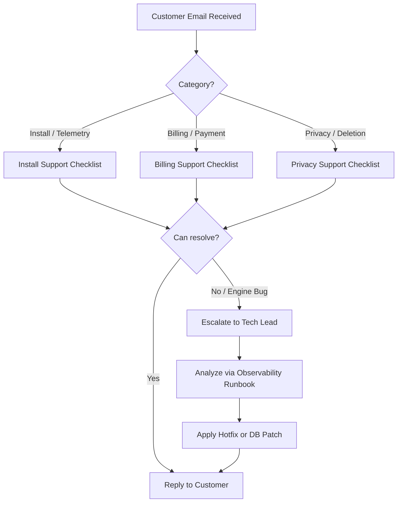

# SourceTrack Paid Beta Support Readiness

This document outlines customer support entry points, contact guidance, required context for bug reports, troubleshooting guides, and operator workflows for the paid beta launch.

---

## 1. Customer Support Entry Points

During the paid beta, we keep support simple, direct, and founder-friendly. No heavy ticketing tools, external helpdesk widget embeds, or live chat bubbles are deployed. Support is handled purely via email.

* **Dashboard Footer (All logged-in pages):** Linked via `mailto:support@sourcetrack.ai`.
* **Billing Page (`/billing`):** Inline contact support email details (`support@sourcetrack.ai`) for billing, cancellation, or refund questions.
* **Settings Page (`/settings`):** Dedicated "Support & Feedback" card advising users to email `support@sourcetrack.ai` with their domain and site key for help.
* **Tracking Snippet Page (`/snippet`):** Embedded "Email Support" link along with links to the setup docs and troubleshooting guide.
* **Onboarding Verification Step (`/onboarding` step 6):** If script verification fails, the failure block renders direct links to the troubleshooting guide and a support email mailto string to allow quick fallback support.
* **Marketing Footer:** Public links to documentation, troubleshooting, and support/sales emails.

---

## 2. Bug Report Required Context

To prevent back-and-forth email loops, all bug reports should contain:

1. **Workspace Site Key:** The public site identifier (starts with `st_`).
2. **Target Domain:** The exact domain name configured in the workspace settings.
3. **Reproducible URL:** The page link where tracking is failing or conversions are not recording.
4. **Platform Stack:** The CMS/server/framework being used (e.g. Webflow, Shopify, custom script, React SPA).
5. **Browser Console Output:** A copy of error messages or warning logs from the browser Developer Tools.
6. **Network Payloads:** A description of whether requests to `/api/track` or `/api/conversion` are failing (returning red statuses in the Network tab).

---

## 3. Install Support Checklist (Triage)

When a customer emails stating tracking "isn't working," follow these verification steps:

1. **Verify Ingestion Status:** Run the doctor script or inspect the active status of the site key via the Super Admin panel or by querying the `sites` database table.

   > [!IMPORTANT]
   > * Read-only triage queries only.
   > * Do not run destructive SQL against production.
   > * Mutations require explicit operator approval and a backup/recovery check.

   ```sql
   SELECT id, domain, status, plan, last_seen_at FROM sites WHERE site_key = 'st_xxxxxx';
   ```
2. **Check Recent Ingested Events:** Query the telemetry logs or check PostHog events for the specific distinct site key to verify if any telemetry was recorded.
3. **Verify Domain Match:** Confirm that the referrer domain of the incoming events matches the configured domain.
4. **Identify Blockers:** Ask the user if they are using strict privacy filters, ad-blockers, or Brave Shields, which suppress outbound analytics endpoints by default.

---

## 4. Billing Support Checklist (Triage)

For billing queries, cancellations, or refund requests:

1. **Locate Customer in Stripe:** Use the email address or site key to search for the corresponding customer profile in the Stripe Dashboard.
2. **Verify Subscription Status:** Verify active/trial plans.
3. **Handle Cancellations:** If a user requests cancellation, guide them to use the Stripe Billing Portal (accessible directly from the dashboard via the "Manage Subscription" button).
4. **Process Refunds:** Never guarantee refunds without review. Review usage, limits, and request context first. If approved, process the refund directly inside the Stripe dashboard.

---

## 5. Privacy & Deletion Support Checklist

Customers can request user or site deletion:

1. **Site Archive:** Archived sites stop accepting pixel telemetry (returns 402 early) but retain history.
2. **Hard Deletion (Workspace/Account):** Hard account deletion wipes workspace sites, members, credentials, and `site_identity_links`.
3. **Visitor Erasure:** To comply with user requests for visitor data wipe (GDPR/CCPA/privacy rights), use the settings visitor erasure trigger or have the administrator initiate deletion for the specific `st_aid` (anonymous visitor ID).

---

## 6. Operator Triage & Escalation Workflow



### Escalation Levels:
* **Level 1 (Triage):** Review client site configuration, check event ingestion database logs, verify Stripe subscription state.
* **Level 2 (Technical Audit):** Check Railway API logs, query PostHog HogQL console for raw event payloads, inspect unhandled exception logs.
* **Level 3 (Emergency Hotfix):** Deploy additive hotfixes for API bugs, perform Railway rollback if regression is detected.

---

## 7. What NOT to Promise

To protect the business and set appropriate customer expectations, follow these rules:

* **Do NOT promise 24/7 support:** Never state or imply that support is monitored round-the-clock.
* **Do NOT promise SLAs or guaranteed response times:** Use soft language: "We’ll review your message and reply as soon as possible."
* **Do NOT guarantee refunds without review:** Every refund request must be reviewed for abuse, usage, and subscription terms before processing.
